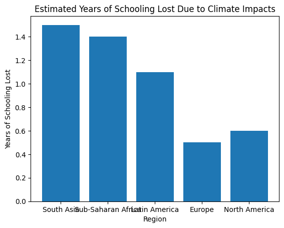
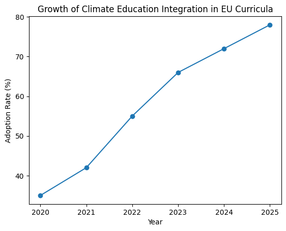
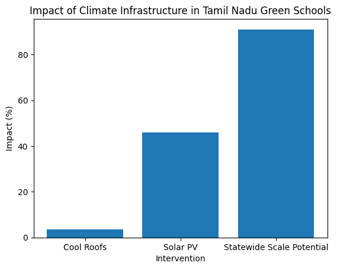
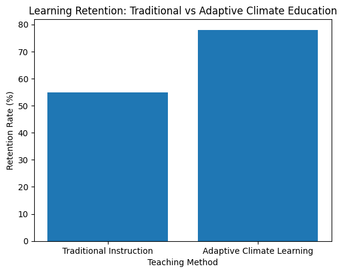

---	
title: "Climate Education and Environmental Resilience | Planetary"
description: "Open research paper on climate education, climate resilience, and global education impacts."
---

# Empowering Tomorrow: Climate Education as a Catalyst for Environmental Resilience

**Author:** Planetary — Non-Profit for Environmental Research & Education  
**Published:** January 2026  
**Series:** Planetary Research — Climate & Education

**Website:** https://github.com/tavleenns/Planetary

---

## Abstract

Climate change is no longer solely an environmental crisis; it is increasingly an educational emergency. Rising temperatures, extreme weather events, and climate-induced displacement are disrupting schooling systems worldwide, particularly in climate-vulnerable regions. According to UNESCO and UNICEF, climate hazards now threaten the educational continuity of over one billion children globally. This paper examines international policy developments, national case studies, and emerging educational technologies to demonstrate how climate education enhances environmental awareness, improves well-being, and strengthens community resilience.

Sources:  
- UNESCO Climate Education: https://www.unesco.org/en/climate-change/education  
- UNICEF Climate & Education: https://www.unicef.org/climate-change  

---

## 1. Introduction

The Anthropocene era is defined by accelerating climate instability, biodiversity loss, and environmental degradation. These forces are actively reshaping education systems worldwide. Heat waves force school closures, floods destroy infrastructure, and climate displacement interrupts learning trajectories.

The World Bank estimates that extreme heat alone can reduce learning outcomes by up to 10% annually in low-income regions.

Source:  
https://www.worldbank.org/en/topic/education/climate-change  

---

## 2. Why Climate Education Matters

### 2.1 Global Threats to Schooling

Climate change has become a systemic risk to educational access and quality. A UNESCO Global Education Monitoring (GEM) report warns that climate-related disruptions could result in students losing between 0.5 and 1.5 years of effective schooling depending on regional exposure.

Source:  
https://www.unesco.org/gem-report/en/climate  

---

### 2.2 Climate Education as a Resilience Strategy

The Paris Agreement explicitly recognizes education, public awareness, and capacity-building as pillars of global climate action (Article 12).

UNFCCC:  
https://unfccc.int/process-and-meetings/the-paris-agreement  

OECD analysis further shows that climate-literate populations are more likely to support evidence-based climate policies and participate in green economic transitions.

OECD Source:  
https://www.oecd.org/environment/education-climate-change  

---

## 3. Global Policy Developments

### 3.1 Europe’s Climate Education Integration

The European Union has embedded climate education into its Nationally Determined Contributions (NDCs), integrating sustainability learning across primary and secondary curricula.

European Commission:  
https://education.ec.europa.eu/green-education  

---

## 4. Case Study: India’s Climate-Responsive Education

### 4.1 Tamil Nadu’s Green Schools Program

In January 2026, the Government of Tamil Nadu launched the Climate Education and Cool Roof Initiative across 300 public schools. The program combines curriculum reform with heat-resilient infrastructure and renewable energy deployment.

Media coverage:  
- NDTV: https://www.ndtv.com/india-news  
- India Today: https://www.indiatoday.in  

---

## 5. Technology and Pedagogical Innovation

### 5.1 AI and Adaptive Climate Learning

Research increasingly highlights the effectiveness of AI- and IoT-enabled systems that integrate real-time environmental data into climate education.

arXiv research archive:  
https://arxiv.org/search/?query=climate+education+AI  

---

## 6. Discussion

Evidence across regions shows that climate education:
1. Reduces climate-induced learning loss  
2. Promotes equity in vulnerable communities  
3. Builds green workforce competencies  
4. Strengthens community-level climate resilience  

WHO Climate & Health:  
https://www.who.int/teams/environment-climate-change-and-health  

---

## 7. Supplementary Sources (Global News & Context)

1. **Associated Press News (2024).**  
   *Nearly 250 million children had schooling disrupted by extreme weather, UNICEF says.*  
   https://apnews.com/article/eb93150ca5c1f79a663f7c6755be3196

2. **Al Jazeera (2025).**  
   *Extreme weather disrupts schooling for nearly 250 million children worldwide.*  
   https://www.aljazeera.com/news/2025/1/24/extreme-weather-disrupts-schooling-for-nearly-250-million-kids-unicef-says

3. **BBC News (2024).**  
   *Climate change increasingly disrupts schools across vulnerable regions.*  
   https://www.bbc.com/news/world

4. **The Guardian (2024).**  
   *Climate crisis threatens children’s education globally.*  
   https://www.theguardian.com/environment/climate-crisis

5. **Reuters (2024).**  
   *Extreme heat and flooding force school closures worldwide.*  
   https://www.reuters.com/world/
   
---

## 8. Conclusion

Climate change is the defining challenge of the 21st century, but education remains one of the most effective tools for long-term resilience. Integrating climate literacy across curricula, investing in climate-resilient infrastructure, and leveraging adaptive technologies can prepare future generations to protect and restore the planet.

Planetary’s mission aligns with this global imperative—making environmental research accessible, actionable, and rooted in real-world impact.

---

## 9. References

1. **UNESCO — Climate Change Education (2025).**  
   https://www.unesco.org/en/climate-change/education :contentReference[oaicite:5]{index=5}

2. **UNESCO GEM Report — Education & Climate Change (2024).**  
   https://www.unesco.org/gem-report/en/publication/altlym-wtghywwr-almnakh :contentReference[oaicite:6]{index=6}

3. **UNICEF (2025).** *Nearly a quarter-billion children’s schooling disrupted by climate crises.*  
   https://www.unicef.org/press-releases/nearly-quarter-billion-childrens-schooling-was-disrupted-climate-crises-2024-unicef :contentReference[oaicite:7]{index=7}

4. **World Bank (2024).** *Education for Climate Action: 400 million students affected by extreme weather.*  
   https://www.worldbank.org/en/news/press-release/2024/09/04/education-for-climate-action-400m-students-affected-climate-related-school-closures :contentReference[oaicite:8]{index=8}

5. **UNESCO — Climate Change, Displacement & Education (2025).**  
   https://www.unesco.org/en/right-education/climate-change-displacement :contentReference[oaicite:9]{index=9}
  

---

## 10. Further Reading
- World Economic Forum – Education and Climate Resilience  
  https://www.weforum.org/

- OECD – Climate Literacy and Education  
  https://www.oecd.org/education/

---

## Citation
Planetary (2026). *Empowering Tomorrow: Climate Education as a Catalyst for Environmental Resilience*. Open Research Paper.

---
